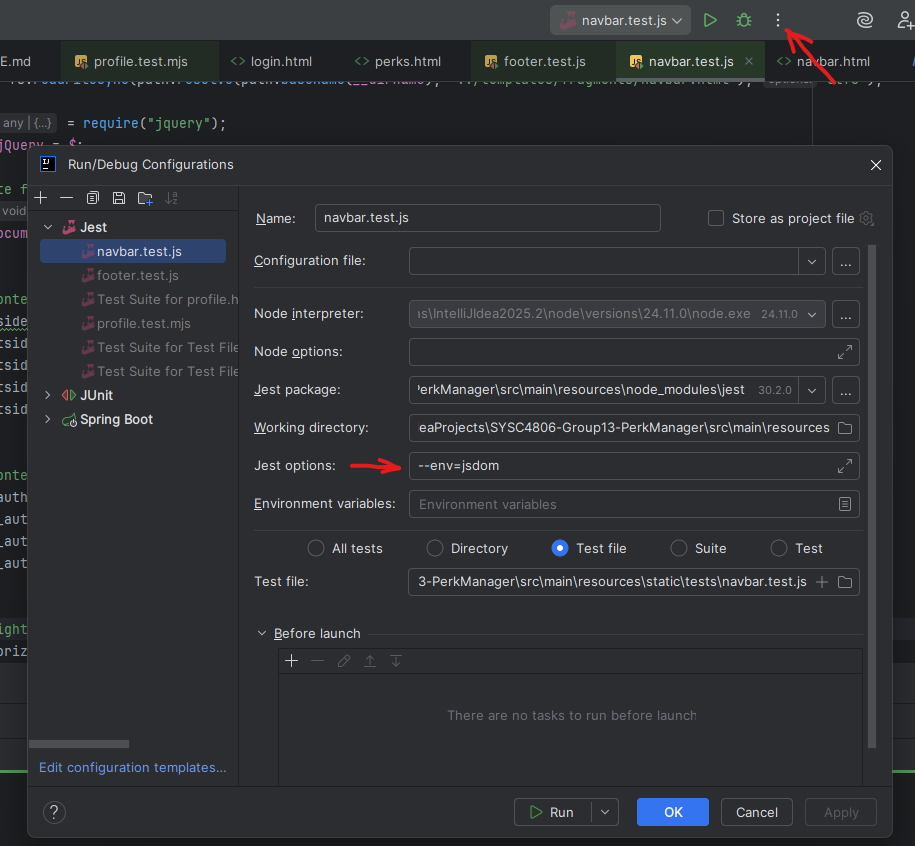
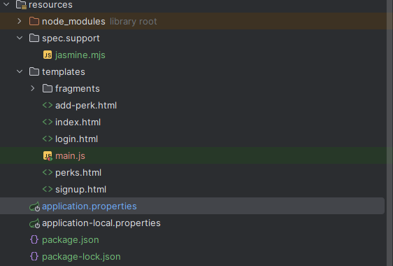
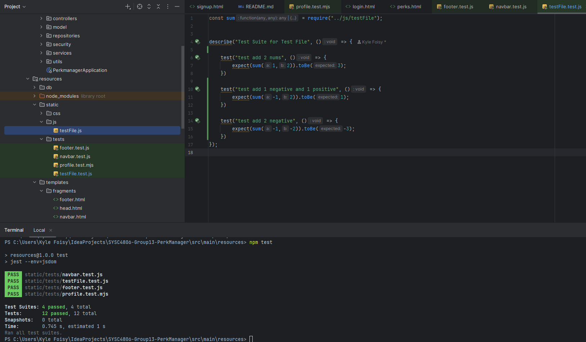

**Project Status:**
[](https://github.com/Tchaoser/SYSC4806-Group13-PerkManager/actions/workflows/maven.yml)

**Azure Deployment Link:**
https://perkmanager-bmanbbccczdtcca4.canadacentral-01.azurewebsites.net/

**Project Members:**

* Kyle Foisy — 101215573
* Peter Grose — 101219562
* Sapthakeerthi Udayakumar — 101289957
* Lucas Warburton — 101276823
* Aziz Hamad — 101232108

---

## **Project Overview**

**PerkManager** is a full-stack web application that helps users track and discover discounts or other perks tied to
their memberships. A user profile may include any number of memberships (e.g., Air Miles, CAA, Visa), and perks describe
benefits such as *"“"10% off movies with Visa"”"* or *"Free domestic flight with 10,000 Air Miles"*. Perks may include
expiry dates, geographic restrictions, and user-submitted descriptions.

The central idea is to make it easy for users to find and organize perks that actually apply to *their* memberships.
Logged-in users receive personalized perk search results tailored to their profile, while guests can still search
globally without personalization.

### **Completed Implementation**

The final version of **PerkManager** includes the full feature set described in the project proposal:

#### **User & Profile Features**

* Users can **register, log in, and manage profiles**.
* Users can **save and remove perks and memberships** from their profile.
* Guest users (not logged-in) can browse perks, but do not receive personalized results.

#### **Perk Features**

* Users can **create new perks, memberships, and products**.
* Perks include **expiry date**, **description**, **vote count**, and **membership/product linkage**.
* Users can **upvote or downvote perks**; the perks page can be sorted by:
    * Score (Upvotes and Downvotes)
    * Expiry date
* Users can **find perks** via the home page's Top-Rated Perks and Soon-to-Expire Perks sections, or by filtering by:
    * Membership types
    * User memberships specifically
    * Region
    * Expiry
* Full **CRUD** support for products and memberships required for posting perks.

#### **Front-End Functionality**

* Thymeleaf templates for all pages: perks, products, memberships, profile, login, signup, etc.
* Dynamic JavaScript for updating tables, handling votes, and saving perk searches.

#### **Back-End Functionality**

* Spring Boot application with full domain model (User, Membership, Product, Perk).
* Business logic handled through dedicated services.
* Persistent storage using Spring Data JPA and schema managed with SQL migrations.

---

## **Client-Side Testing (Jest)**

As part of the project’s **client-side testing** subtopic, the application includes a suite of **Jest** tests for DOM
behavior and JavaScript functionality.

This was integrated into the Node.js toolchain and demonstrated in the group presentation. The Jest tests cover:

* DOM loading using **jsdom**
* Event simulation (e.g., clicking vote/save buttons)
* Fetch call mocking (verifying correct POST requests)
* Verification of elements such as the navbar/footer
* Logic for filtering, updating, and rendering perk tables

Example tests include verifying that clicking a vote button triggers the correct API call, that UI updates occur in
response to user actions, and that DOM fragments render as expected.

---

### **Subtopic Summary**

* Jest was chosen because it is modern, widely used, well-documented, and integrates easily with Node.js.
* It supports **jquery** and **jsdom**, matching our client-side codebase.
* Jasmine and Mocha were evaluated but not used due to higher setup overhead and weaker integration with our DOM and
  mock requirements.
* A GitHub Actions workflow runs Jest as part of the CI pipeline.

This fulfills the "Client-Side Testing" subtopic requirement and demonstrates how front-end tests complement the Java
integration tests in the backend.

## **Final Project Structure**

```
perkmanager/
├─ src/
│  ├─ main/
│  │  ├─ java/com/example/perkmanager/
│  │  │  ├─ PerkmanagerApplication.java     # Main Spring Boot entry point
│  │  │  │
│  │  │  ├─ config/
│  │  │  │  └─ SecurityConfig.java          # Login/authentication setup
│  │  │  │
│  │  │  ├─ controllers/
│  │  │  │  ├─ AccountController.java       # Manages user registration, signup, and login
│  │  │  │  ├─ HomeController.java          # Manages homepage and featured perks sections
│  │  │  │  ├─ PerkController.java          # Manages creating, listing, and voting on perks
│  │  │  │  ├─ ProductController.java       # Manages product creation, listing, and form validation
│  │  │  │  ├─ ProfilController.java        # Manages user profiles and saved perks and memberships 
│  │  │  │  └─ MembershipController.java    # Manages available memberships, handles add/remove
│  │  │  │
│  │  │  ├─ model/
│  │  │  │  ├─ Account.java                 # JPA entity: account (name, email, memberships)
│  │  │  │  ├─ Membership.java              # JPA entity: membership (CAA, Visa, etc.)
│  │  │  │  ├─ Product.java                 # JPA entity: product or service (flight, movie, etc.)
│  │  │  │  └─ Perk.java                    # JPA entity: perk (description, votes, expiry)
│  │  │  │
│  │  │  ├─ repositories/
│  │  │  │  ├─ AccountRepository.java       # Manages CRUD operations and username lookup for users
│  │  │  │  ├─ MembershipRepository.java    # Manages CRUD operations for memberships
│  │  │  │  ├─ ProductRepository.java       # Manages CRUD operations for products
│  │  │  │  └─ PerkRepository.java          # Manages CRUD operations for perks and custom queries
│  │  │  │
│  │  │  ├─ security/
│  │  │  │  └─ AccountDetailsService.java   # Loads user account details for Spring Security authentication
│  │  │  │
│  │  │  ├─ services/
│  │  │  │  ├─ AccountService.java          # Manages user accounts, profiles, and membership linking
│  │  │  │  ├─ PerkService.java             # Manages perks, including creation, voting, and expiry
│  │  │  │  ├─ MembershipService.java       # Manages memberships and CRUD operations
│  │  │  │  └─ ProductService.java          # Manages products and CRUD operations
│  │  │  │
│  │  │  └─ utils/
│  │  │     └─ PasswordHashGen.java         # Standalone utility to generate bcrypt hashes for demo accounts
│  │  │
│  │  ├─ resources/
│  │  │  ├─ db/
│  │  │  │  ├─ migrations/
│  │  │  │  │  ├─ V1__create_schema.sql     # SQL migration: creates all tables
│  │  │  │  │  └─ V2__insert_base_data.sql  # SQL migration: inserts base reference data (memberships, products)
│  │  │  │  │
│  │  │  │  ├─ data/
│  │  │  │  │  └─ demo_data.sql             # Demo/staging data with bcrypt passwords and sample perks
│  │  │  │  │
│  │  │  │  └─ maintenance/
│  │  │  │     ├─ drop_all.sql              # Helper to drop all tables if you want a clean slate
│  │  │  │     └─ reset_all.sql             # Helper to drop + re-run migrations + load demo data
│  │  │  │ 
│  │  │  ├─ node_modules/                   # Directory containing generated Node.js and Jest libraries and dependancies
│  │  │  │
│  │  │  ├─ static/
│  │  │  │  ├─ css/
│  │  │  │  │  └─ styles.css                # File for global styling
│  │  │  │  │ 
│  │  │  │  ├─ js/
│  │  │  │  │  ├─ perks-table.js            # Handles dynamic perks table updates, sorting, pagination, and preloading
│  │  │  │  │  ├─ save-memberships.js       # Handles saving and unsaving memberships for logged-in users
│  │  │  │  │  ├─ save-perks.js             # Manages saving and unsaving perks for logged-in users
│  │  │  │  │  └─ votes.js                  # Handles perk upvoting and downvoting with live UI updates
│  │  │  │  │ 
│  │  │  │  ├─ tests/
│  │  │  │  │  ├─ footer.test.js            # Verifies footer HTML elements render correctly
│  │  │  │  │  ├─ membership-page-test.html # Captured static page used by membership save tests
│  │  │  │  │  ├─ navbar.test.js            # Verifies navbar HTML elements render correctly
│  │  │  │  │  ├─ profile.test.js           # Verifies profile page HTML and dynamic content
│  │  │  │  │  ├─ votes.test.js             # Tests perk upvoting/downvoting functionality
│  │  │  │  │  ├─ save-memberships.test.js  # Tests saving/unsaving memberships with simulated DOM and fetch calls
│  │  │  │  │  ├─ save-perks.test.js        # Tests saving/unsaving perks with simulated DOM and fetch calls
│  │  │  │  │  └─ perks-page-test.html      # Captured static page used by perk voting and save tests
│  │  │  │ 
│  │  │  ├─ templates/
│  │  │  │  ├─ fragments/
│  │  │  │  │  ├─ head.html                 # Reusable head component
│  │  │  │  │  ├─ navbar.html               # Reusable navbar component
│  │  │  │  │  └─ footer.html               # Reusable footer component
│  │  │  │  │
│  │  │  │  ├─ add-membership.html          # Page for creating new Memberships
│  │  │  │  ├─ add-perk.html                # Page for creating new Perks
│  │  │  │  ├─ add-product.html             # Page for creating new Products
│  │  │  │  ├─ index.html                   # Homepage showing navigation options
│  │  │  │  ├─ perks.html                   # Displays all perks (sortable by votes or expiry)
│  │  │  │  ├─ memberships.html             # Displays all memberships
│  │  │  │  ├─ products.html                # Displays all products
│  │  │  │  ├─ profile.html                 # Displays the user's profile
│  │  │  │  ├─ login.html                   # Login page for existing users
│  │  │  │  └─ signup.html                  # Registration page for new users
│  │  │  │
│  │  │  ├─ application.properties          # Base config (active profile, Thymeleaf settings)
│  │  │  ├─ application-local.properties    # Local dev settings
│  │  │  ├─ package.json                    # Config file for Node.js for running Jest
│  │  │  └─ package-lock.json               # Config file for Node.js for running Jest
│  │
│  └─ test/java/com/example/perkmanager/
│     ├─ config/
│     │  └─ SecurityConfigTest.java         # Verifies authentication and access control setup
│     │
│     ├─ controllers/
│     │  └─ AccountControllerTest.java      # Verifies login, registration, and session routes
│     │  └─ HomeControllerTest.java         # Verifies home page logic, featured top-rated and expiring perks
│     │  └─ MembershipControllerTest.java   # Verifies membership listing, add form, and creation
│     │  └─ PerkControllerTest.java         # Verifies listing, adding, voting, and form handling for perks
│     │  └─ ProductControllerTest.java      # Verifies product listing, add form, and creation
│     │  └─ ProfileControllerTest.java      # Verifies user profile view, membership add/remove, and guest handling
│     │
│     ├─ model/
│     │  ├─ AccoutTest.java                 # Verifies User entity fields, relationships, validation
│     │  ├─ MembershipTest.java             # Verifies Membership entity mapping and constraints
│     │  ├─ ProductTest.java                # Verifies Product entity persistence and associations
│     │  └─ PerkTest.java                   # Verifies Perk entity logic (expiry, voting count)
│     │
│     └─ services/
│        ├─ AccountServiceTest.java         # Verifies account creation, login, and linking logic
│        ├─ PerkServiceTest.java            # Verifies business logic (votes, expiry filters)
│        ├─ MembershipServiceTest.java      # Verifies membership CRUD and validation
│        └─ ProductServiceTest.java         # Verifies product CRUD and validation
│
├─ pom.xml                                  # Maven build file (Spring Boot, JPA, Thymeleaf, etc.)
├─ .gitignore                               # Ignored files and directories (build output, logs, local env files, etc.)
├─ .env                                     # Environment variables (DB credentials, Azure URL, etc.)
│
├─ .github/
│  └─ workflows/
│     ├─ maven.yml                          # CI workflow: builds Java project using Maven on push/PR to main
│     ├─ jest.yml                           # CI workflow: runs Jest unit testing to verify front-end elements
│     └─ main-perkmanager.yml               # CD workflow: builds JAR and deploys PerkManager to Azure Web App
│
└─ README.md                                # Project overview, setup, usage, and contribution guide
```

---

## Database Schema


## UML Class Diagram


---

# How to run locally:

1. Download and unzip the project.
2. Follow the steps for connecting to the Shared Aiven Database below in "PerkManager: Developer Database Setup (
   Windows)".
3. Execute the following command in a terminal window in the project root directory:

```
mvn clean spring-boot:run
```

---

# PerkManager: Developer Database Setup (Windows)

## Prerequisites

* Java 17+, Maven, IntelliJ IDEA
* Internet access (for shared PostgreSQL)
* Node.js & npm (for Jasmine testing)

---

## Shared Aiven Database

> Cloud DB shared for all developers. Follow **The Twelve-Factor App** principles: no local DB needed.

### 1. Configure Spring Boot

In `src/main/resources/application.properties`, set:

```properties
spring.datasource.password=${DATABASE_PASSWORD}  # Enter your Aiven password
```

> The deployment environment uses the same environment variable (`DATABASE_PASSWORD`) on Azure.

### 2. Verify Connection in IntelliJ

1. Open **Database** tool window → **+ → Data Source → PostgreSQL**
2. Use these values:

| Field    | Value                                           |
|----------|-------------------------------------------------|
| Host     | `pg-2257ce90-perkmanager-0641.f.aivencloud.com` |
| Port     | `24494`                                         |
| Database | `defaultdb`                                     |
| User     | `avnadmin`                                      |
| Password | `<AIVEN PASSWORD>`                              |
| SSL Mode | `require`                                       |

3. Click **Test Connection → OK**.

### 3. Run the App

* Run `PerkmanagerApplication` (IntelliJ or `mvn spring-boot:run`)
* Hibernate auto-creates/updates tables.
* Once run, you can browse the shared DB anytime without restarting the app.

---

## SQL Scripts: Developer Workflow

> Stop Spring Boot before running scripts.

| Script                     | Purpose                                                 |
|----------------------------|---------------------------------------------------------|
| `V1__create_schema.sql`    | Creates all tables from scratch (drops existing tables) |
| `V2__insert_base_data.sql` | Populates memberships and products                      |
| `demo_data.sql`            | Adds demo accounts, perks, and relationships            |

**Demo accounts**:

| Username | Password  |
|----------|-----------|
| alice    | password1 |
| bob      | password2 |
| charlie  | password3 |
| dana     | password4 |
| evan     | password5 |

**Optional Maintenance**:

* `drop_all.sql` - Drops all tables
* `reset_all.sql` - Clears data but keeps schema

**Day-to-Day Workflow**:

1. Stop app
2. Run `reset_all.sql` (if needed)
3. Run `V2__insert_base_data.sql` + `demo_data.sql`
4. Start app and log in with demo accounts

> For schema changes, always create new migration files instead of modifying existing ones.

## Installing and Running Jest Client Side Testing:

1. Download and install Node.js and npm: https://docs.npmjs.com/downloading-and-installing-node-js-and-npm
2. Open a terminal (or cmd prompt) and navigate to `src/main/resources/` in your project.
3. Run: `npm install` to install all required dependencies.
4. Run: `npm test` to execute the tests.

Any test failures will be displayed in the terminal (or cmd prompt).

**Note:** Some tests can be run directly in intellij. For tests that require jQuery or DOM, set run with parameter:
--env=jsdom


## Creating Client-Side Tests:

- Jest will run any JS files within the given directory if they have <name>.test.js and they have describe() or test()
  in them.

To create a test suite for a .js file, use:

```javascript
describe("test suite description here", function () {
    beforeEach(() => {
        //Setup code here
    });

    test("Verify contents of footer", () => {
        expect("some actual value").to //Some condition specified by jest relative to expected value

    });
});
```

### Example:



---
